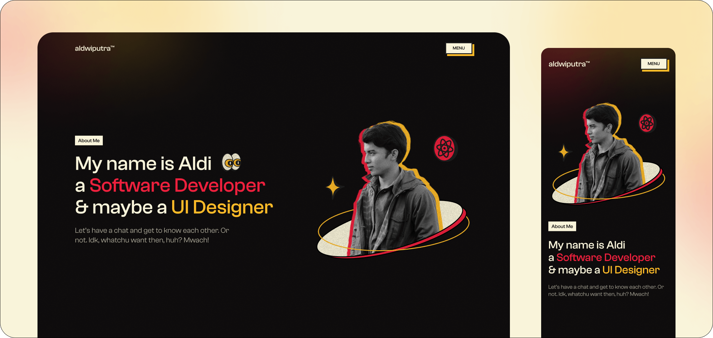

# Aldiansyah's Website

This is a personal website built for the second week's assignment. It has been amazing working on this website, because.. I don't know, it's just fun, don't ask me 🥺. I'll just keep writing so this paragraph won't look ugly. Blablabla as I go bluhbluhbluh. I don't know what I'm writing but hey, at least it's long hehehe ✌🏼.

## :rocket: Visit Below

[https://aldwiputra.netlify.app](https://aldwiputra.netlify.app)

## :wrench: Technologies Used

 &#xa0; &#xa0;
 &#xa0; &#xa0;
 &#xa0; &#xa0;
